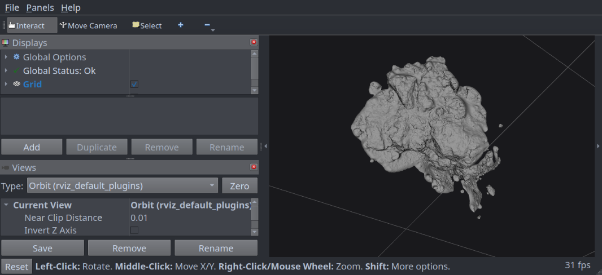
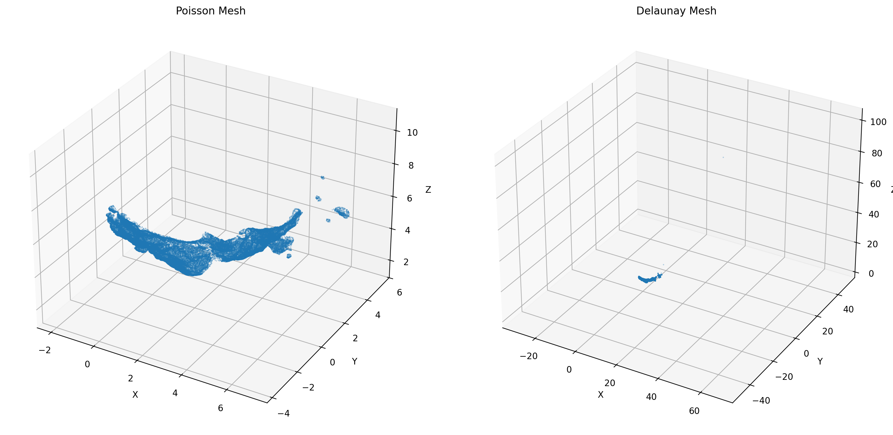
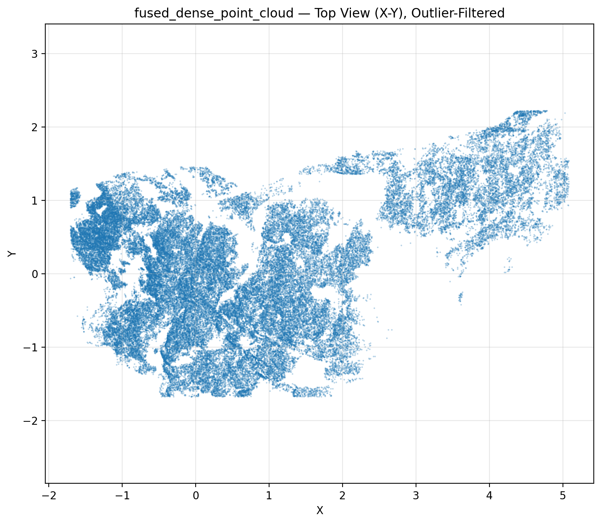
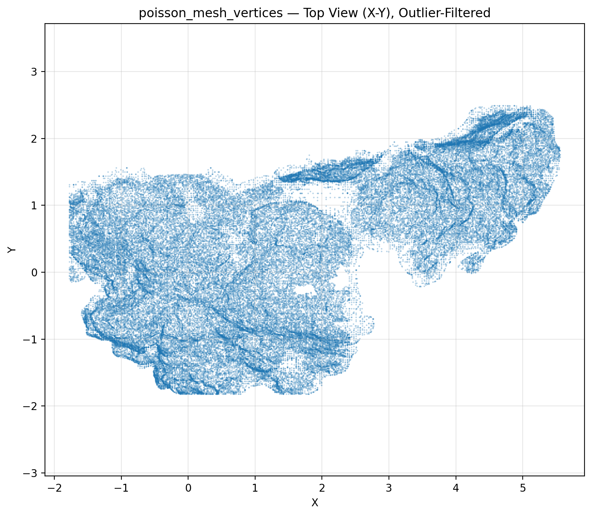

# **ApolloSplat-Py**

**Sparse Lunar Photogrammetry to ROS2-Ready Terrain Assets**

> **A Python-based photogrammetry pipeline for reconstructing a lunar terrain patch from Apollo 17 image sequences using COLMAP, meshing, and ROS2/RViz2 asset export.**



---

## Abstract

ApolloSplat-Py takes a short sequence of 15 Apollo 17 lunar surface photographs and turns them into a usable 3D terrain asset. The pipeline runs COLMAP structure-from-motion and multi-view stereo, fuses depth maps into a dense colored point cloud (580,552 points), generates baseline meshes via Poisson and Delaunay meshing, selects the cleaner Poisson mesh (189,669 vertices, 377,096 faces), and exports it as PLY/OBJ/STL into a ROS2 URDF/RViz2 visualization package.

The final deliverable is a **curved lunar terrain patch**, not a clean isolated rock model. Gaussian Splatting was explored as an augmentation path but was not used for the final reconstruction because CUDA extension compilation was unstable on the development system. The robust final output is the COLMAP-to-ROS2 mesh asset, confirmed working in RViz2.

**Key Insight:** Even with only 15 historical monocular images, COLMAP can recover a geometrically consistent terrain patch, but mesh topology is dominated by outlier-driven artifacts unless robust filtering and Poisson reconstruction are applied.

**Project status: COMPLETED.** - all 21/21 manifest artifacts produced, zero missing.

## Motivation

Photogrammetric reconstruction from historical lunar imagery is constrained by sparse viewpoints, limited overlap, and unknown precise camera calibration. Apollo 17 mission photographs provide a rare multi-view sequence of lunar terrain, but with only 15 frames the reconstruction problem is under-determined compared to modern capture setups.

This project treats the problem as an engineering experiment: build a reproducible pipeline from raw imagery to a ROS2-compatible 3D asset, document every stage quantitatively, and be honest about what works and what does not.

The secondary research question, whether Gaussian Splatting-rendered novel views can improve sparse photogrammetry, was posed but not fully answered due to CUDA toolchain limitations. The baseline COLMAP reconstruction stands as the validated deliverable.

## Key Features

- End-to-end notebook-driven pipeline from raw Apollo 17 PNGs to ROS2/RViz2 mesh visualization.
- COLMAP sparse SfM + dense MVS + Poisson/Delaunay meshing with quantitative diagnostics.
- Robust geometry filtering and bounding-box analysis to detect meshing artifacts.
- Multi-format mesh export (PLY, OBJ, STL) with vertex colors and normals.
- Complete ROS2 package with URDF, launch file, and RViz2 configuration.
- Full artifact manifest with 26 CSV diagnostic tables and 11 visualization figures.
- Technically honest treatment of limitations and failure modes.

## Pipeline Overview

```
Raw Apollo 17 Images (N=15)
        │
        ▼
  Image Preprocessing
  (resize, crop, RGB normalize)
        │
        ▼
  COLMAP Feature Extraction
  (SIFT keypoints)
        │
        ▼
  COLMAP Feature Matching
  (exhaustive pairwise)
        │
        ▼
  Sparse Structure-from-Motion
  (13/15 images registered)
        │
        ▼
  Dense PatchMatch Stereo
  (per-view depth + normal maps)
        │
        ▼
  Stereo Fusion
  (580,552 colored 3D points)
        │
        ▼
  Mesh Reconstruction
  ├── Poisson  → 189,669 verts, 377,096 faces  ✓ Selected
  └── Delaunay → 120,016 verts, 240,456 faces  ✗ Stretched artifacts
        │
        ▼
  Geometry Diagnostics
  (robust filtering, bbox analysis)
        │
        ▼
  ROS2 Asset Export
  (PLY / OBJ / STL + URDF + RViz2 config)
        │
        ▼
  RViz2 Visualization.
```

## Mathematical Formulation

### Camera Projection Model

Each 3D scene point is projected into image coordinates via the pinhole model:

$$
\mathbf{x}_{ij} \sim \mathbf{K}_i [\mathbf{R}_i \mid \mathbf{t}_i] \mathbf{X}_j
$$

where $\mathbf{X}_j \in \mathbb{R}^3$ is a reconstructed 3D point, $\mathbf{x}_{ij} \in \mathbb{R}^2$ is its observation in image $i$, $\mathbf{K}_i$ is the camera intrinsic matrix, and $\mathbf{R}_i, \mathbf{t}_i$ are the camera pose (rotation and translation).

### Sparse Reconstruction / Bundle Adjustment

Structure-from-Motion jointly estimates camera poses and 3D point positions by minimizing reprojection error:

$$
\min_{\{\mathbf{R}_i,\mathbf{t}_i,\mathbf{X}_j\}}
\sum_{(i,j)\in \mathcal{O}}
\rho\!\left(
\left\|
\mathbf{x}_{ij} -
\pi(\mathbf{K}_i, \mathbf{R}_i, \mathbf{t}_i, \mathbf{X}_j)
\right\|_2^2
\right)
$$

where $\rho(\cdot)$ is a robust loss function (e.g., Cauchy or Huber) and $\mathcal{O}$ is the set of valid image–point observations. COLMAP's incremental SfM solver handles this automatically.

### Dense Multi-View Stereo

PatchMatch stereo estimates a per-pixel depth map for each registered view:

$$
D_i(u,v)
$$

Stereo fusion then combines geometrically consistent depth hypotheses across views into a dense colored point cloud:

$$
\mathcal{P}_{\text{dense}} = \{ (\mathbf{p}_k, \mathbf{c}_k) \}_{k=1}^{N}
$$

where $\mathbf{p}_k \in \mathbb{R}^3$ is a 3D point position and $\mathbf{c}_k \in \mathbb{R}^3$ is its RGB color.

### Mesh Reconstruction

**Poisson surface reconstruction** estimates an implicit indicator function $\chi$ whose gradient field approximates the oriented normal field $\mathbf{V}$ induced by the point cloud:

$$
\nabla \chi \approx \mathbf{V}
$$

The mesh is extracted as the iso-surface of $\chi$. This produces watertight, smooth surfaces but can hallucinate geometry in under-sampled regions.

**Delaunay meshing** partitions space using a 3D Delaunay tetrahedralization and extracts a surface via graph-cut labeling of inside/outside cells. It preserves more raw spatial extent but introduced long stretched artifacts in this dataset due to sparse outlier points.

### ROS2 Asset Representation

The final mesh is wrapped in a URDF link with a static transform:

$$
{}^{world}\mathbf{T}_{mesh}
$$

anchoring the visual geometry at the world origin. RViz2 renders the mesh via `robot_state_publisher` using the referenced OBJ/STL asset.

## Repository Structure

```
ApolloSplat-Py/
├── data/
│   └── raw/
│       └── apollo17/
│           ├── AS17-137-20903HR.png
│           ├── AS17-137-20904HR.png
│           ├── ...                          # 15 raw Apollo 17 frames
│           └── AS17-138-21037HR.png
│
├── docs/
│   ├── figures/
│   │   ├── dataset_preview_grid.png
│   │   ├── processed_dataset_preview_grid.png
│   │   ├── baseline_poisson_vs_delaunay_preview.png
│   │   ├── fused_dense_point_cloud_top_view_filtered.png
│   │   ├── poisson_mesh_vertices_top_view_filtered.png
│   │   └── ...                              # 11 diagnostic figures
│   ├── rviz1export/
│   │   └── RViz2_snap.png
│   └── tables/
│       ├── final_project_snapshot.csv
│       ├── final_results_export_manifest.csv
│       ├── baseline_dense_fusion_summary.csv
│       ├── baseline_mesh_stats.csv
│       ├── baseline_geometry_diagnostic_summary.csv
│       └── ...                              # 26 CSV diagnostic tables
│
├── notebooks/
│   └── 01_apollosplat_end_to_end.ipynb      # Primary pipeline notebook
│
├── outputs/
│   ├── baseline_colmap/
│   │   ├── database.db
│   │   ├── baseline_selected_mesh.ply
│   │   ├── sparse/
│   │   │   └── 0/
│   │   │       ├── cameras.bin
│   │   │       ├── images.bin
│   │   │       └── points3D.bin
│   │   └── dense/
│   │       ├── fused.ply                    # 580,552-point colored cloud
│   │       ├── meshed-poisson.ply           # Selected mesh
│   │       ├── meshed-delaunay.ply          # Diagnostic mesh (rejected)
│   │       └── stereo/
│   │           ├── depth_maps/              # 13 geometric + 13 photometric
│   │           └── normal_maps/             # 13 geometric + 13 photometric
│   │
│   └── ros2_export/
│       ├── meshes/
│       │   ├── apollo_lunar_patch.ply
│       │   ├── apollo_lunar_patch.obj
│       │   └── apollo_lunar_patch.stl
│       └── apollo_lunar_patch_viz/          # ROS2 package
│           ├── package.xml
│           ├── CMakeLists.txt
│           ├── launch/
│           │   └── view_apollo_lunar_patch.launch.py
│           ├── meshes/
│           │   ├── apollo_lunar_patch.obj
│           │   ├── apollo_lunar_patch.ply
│           │   └── apollo_lunar_patch.stl
│           ├── rviz/
│           │   └── apollo_lunar_patch.rviz
│           └── urdf/
│               └── apollo_lunar_patch.urdf
│
├── README.md
└── requirements.txt
```

> **Note:** `outputs/ros2_export/build/`, `outputs/ros2_export/install/`, and `outputs/ros2_export/log/` are generated by `colcon build` and should be excluded from version control.

## Installation

### Python Environment

Python 3.10+ recommended.

```bash
git clone <repo-url>
cd ApolloSplat-Py

python -m venv .venv
source .venv/bin/activate
pip install -r requirements.txt
```

### Python Dependencies

- NumPy
- Pandas
- OpenCV (`opencv-python`)
- Open3D
- Matplotlib
- SciPy
- Jupyter / JupyterLab

### External Tools

The following must be installed and available on `PATH`:

```bash
colmap --help        # COLMAP 3.8+
ros2 --help          # ROS2 Jazzy or Humble
rviz2 --help         # RViz2
colcon --help        # colcon build tool
```

### ROS2 Environment

```bash
source /opt/ros/<ros-distro>/setup.bash
```

Replace `<ros-distro>` with your distribution (e.g., `jazzy` or `humble`).

**Pop!_OS / Wayland users** :: if RViz2 crashes or shows a blank window:

```bash
export QT_QPA_PLATFORM=xcb
```

## How to Reproduce

### 1. Run the Pipeline Notebook

```bash
jupyter lab notebooks/01_apollosplat_end_to_end.ipynb
```

Execute cells sequentially. The notebook orchestrates COLMAP, generates all diagnostic tables and figures, builds meshes, and exports the ROS2 package.

### 2. Launch in RViz2

```bash
cd outputs/ros2_export
colcon build --packages-select apollo_lunar_patch_viz
source install/setup.bash
ros2 launch apollo_lunar_patch_viz view_apollo_lunar_patch.launch.py
```

If RViz2 has display issues on Wayland:

```bash
export QT_QPA_PLATFORM=xcb
ros2 launch apollo_lunar_patch_viz view_apollo_lunar_patch.launch.py
```

## Results

### Reconstruction Summary

| Metric | Value |
| :--- | ---: |
| Processed images | 15 |
| Registered images | 13 / 15 |
| Dense fused points | 580,552 |
| Selected mesh | Poisson |
| Selected mesh vertices | 189,669 |
| Selected mesh faces | 377,096 |
| ROS2 visualization | Confirmed in RViz2 |
| Final manifest artifacts | 21 / 21 |
| Missing artifacts | 0 |

### Mesh Comparison

| Mesh | Vertices | Faces | BBox X | BBox Y | BBox Z | Surface Area | Selected |
| :--- | ---: | ---: | ---: | ---: | ---: | ---: | :---: |
| Poisson | 189,669 | 377,096 | 9.093 | 5.482 | 5.764 | 41.128 | ✓ |
| Delaunay | 120,016 | 240,456 | 42.280 | 5.580 | 97.045 | 47.890 | ✗ |

Delaunay's bounding box in X and Z is ~5–17× larger than Poisson's, confirming stretched artifacts from sparse outlier points. Robust filtered diagnostics (keeping ~95% of points within the 1st–99th percentile) show both meshes converge to a similar core terrain extent (~7 × 4 × 3 units).

### Dense Fusion

| Metric | Value |
| :--- | ---: |
| Fused points | 580,552 |
| Has colors | Yes |
| Raw bounding box | 42.28 × 6.21 × 118.94 |
| Robust bounding box (1–99 pctl) | 6.79 × 3.90 × 2.51 |
| File size | 14.95 MB |

## Visual Outputs

### Raw Dataset


### Processed Dataset


### Mesh Comparison



### Geometry Diagnostics





## ROS2 / RViz2 Usage

### Exported Assets

| Format | Path | Purpose |
| :--- | :--- | :--- |
| PLY | `outputs/ros2_export/meshes/apollo_lunar_patch.ply` | Colored mesh / point-cloud-friendly asset |
| OBJ | `outputs/ros2_export/meshes/apollo_lunar_patch.obj` | RViz2 visual mesh workflow |
| STL | `outputs/ros2_export/meshes/apollo_lunar_patch.stl` | Geometry-only fallback |

### Package Contents

| Artifact | Path |
| :--- | :--- |
| URDF model | `apollo_lunar_patch_viz/urdf/apollo_lunar_patch.urdf` |
| Launch file | `apollo_lunar_patch_viz/launch/view_apollo_lunar_patch.launch.py` |
| RViz2 config | `apollo_lunar_patch_viz/rviz/apollo_lunar_patch.rviz` |
| Package manifest | `apollo_lunar_patch_viz/package.xml` |
| CMake config | `apollo_lunar_patch_viz/CMakeLists.txt` |

The URDF places the mesh at the world origin with a static `robot_state_publisher`. RViz2 loads the pre-configured `.rviz` file automatically via the launch script.

## Output Artifacts

### Documentation Tables

| Table | Path |
| :--- | :--- |
| Final project snapshot | `docs/tables/final_project_snapshot.csv` |
| Export manifest | `docs/tables/final_results_export_manifest.csv` |
| Dense fusion summary | `docs/tables/baseline_dense_fusion_summary.csv` |
| Mesh statistics | `docs/tables/baseline_mesh_stats.csv` |
| Geometry diagnostics | `docs/tables/baseline_geometry_diagnostic_summary.csv` |
| Reconstruction summary | `docs/tables/baseline_reconstruction_summary.csv` |
| ROS2 package summary | `docs/tables/ros2_visualization_package_summary.csv` |

All 26 CSV tables are stored in `docs/tables/`. All 11 diagnostic figures are in `docs/figures/`.

## Gaussian Splatting Note

Gaussian Splatting was explored as a natural extension to augment the sparse 15-image dataset through synthetic novel view generation. The baseline COLMAP reconstruction (sparse model + calibrated views) was fully validated and confirmed compatible with standard Gaussian Splatting pipelines (`docs/tables/gaussian_splatting_readiness_summary.csv`), and a local implementation was successfully identified and prepared.

While full training was not executed in this iteration due to CUDA extension build instability (`diff-gaussian-rasterization`, `simple-knn`) on the development system, this outcome highlights an important systems-level observation: modern neural rendering pipelines remain sensitive to toolchain configuration, particularly in GPU-accelerated environments.

Crucially, this does not limit the methodological viability of Gaussian Splatting for this problem. The pipeline is structurally ready, and the integration path is well-defined. In a controlled CUDA/containerized environment, Gaussian Splatting is expected to enable:

- novel view synthesis,
- improved geometric completeness,
- and potential refinement of sparse photogrammetric reconstructions.

As such, Gaussian Splatting stands as a validated and promising next-stage extension, rather than a failed component. The current work establishes a stable classical baseline upon which this learning-based enhancement can be systematically deployed.

## Limitations

- **Historical monocular imagery.** Reconstruction quality depends on overlap, viewpoint variation, and texture. Apollo mission photographs were not taken for photogrammetry.
- **Terrain patch, not isolated object.** The final mesh is a curved terrain surface, not a segmented rock model.
- **Delaunay artifacts.** Delaunay meshing produced large stretched geometry from sparse outlier points and was rejected for export.
- **Poisson smoothing.** Poisson reconstruction produces watertight meshes but may smooth sharp features or close open geometry.
- **No metric validation.** The reconstruction is not validated against ground-truth lunar elevation data.
- **Gaussian Splatting incomplete.** Training was skipped due to CUDA extension build instability.
- **Visualization only.** The ROS2 export is intended for visual inspection, not physics simulation or collision modeling.
- **Two images unregistered.** COLMAP failed to register 2 of 15 images, likely due to insufficient overlap or viewpoint discontinuity.

## Why 'THIS MATTERS' for Robotics?

This project is not only a reconstruction exercise; it is a robotics-relevant perception and mapping pipeline. The Apollo 17 terrain patch can be treated as a compact testbed for terrain mapping, planetary robotics, and perception under sparse-data conditions. In particular, it produces reusable simulation assets that can support downstream work in RViz2, ROS2, and autonomous navigation experiments. That makes the reconstruction valuable as both a scientific artifact and a robotics infrastructure component.

## Potential Extensions

- Improve image selection and masking for object-specific reconstruction.
- Add scale calibration using known Apollo camera metadata or scene references.
- Generate simplified collision meshes for Gazebo / Isaac Sim.
- Add texture and material export (UV-mapped OBJ).
- Retry Gaussian Splatting training in a clean CUDA/container environment.
- Add automated quality metrics for reconstruction completeness.
- Build a self-contained ROS2 demo workspace with pre-built assets.
- Add mesh decimation for real-time robotics visualization.
- Investigate NeRF-based alternatives for novel view synthesis.

## Citations / Credits

### Apollo 17 Imagery

The raw lunar surface photographs are from the Apollo 17 mission (December 1972), courtesy of NASA. Image IDs: AS17-137-20903 through AS17-137-20909 and AS17-138-21030 through AS17-138-21037.

### Software

- [COLMAP](https://colmap.github.io/): Schönberger & Frahm, "Structure-from-Motion Revisited," CVPR 2016.
- [Open3D](http://www.open3d.org/): Zhou, Park, & Koltun, "Open3D: A Modern Library for 3D Data Processing," 2018.
- [ROS2](https://docs.ros.org/): Open Robotics.
- [Gaussian Splatting](https://github.com/graphdeco-inria/gaussian-splatting): Kerbl et al., "3D Gaussian Splatting for Real-Time Radiance Field Rendering," SIGGRAPH 2023 (explored, not used in final pipeline).

### **Academic Context & Acknowledgment**

This micro-project was completed as part of:

**SES 598: Space Robotics & AI**  
Arizona State University  

**Instructor:** Prof. Jnaneshwar Das  
**GitHub:** https://github.com/darknight-007  

**Course Assignment Repository:**

https://github.com/darknight-007/ses598-space-robotics-and-ai-2026

The course is affiliated with the  
**Distributed Robotic Exploration and Mapping Systems (DREAMS) Laboratory**  
**GitHub:** https://github.com/DREAMS-lab  
**Website:** https://deepgis.org/dreamslab  

The assignment/micro-project structure, evaluation methodology, and coverage-control framework were inspired by course material and lab research themes in autonomous systems and robotic exploration.

### **Author**

Ayushman M. (https://github.com/aymisxx)  
M.S. Robotics & Autonomous Systems (MAE)  
Arizona State University

### **License**

Creative Commons Attribution 4.0 International License (CC-BY-4.0)

---